# 📱 Chatzilla - Real-Time Flutter Chat App

**Chatzilla** is a modern, real-time mobile chat application built with Flutter and Firebase. It provides a secure, scalable, and responsive platform for one-on-one messaging, designed to be easily extendable and integrable with larger systems in the future.

## 📋 Table of Contents

- [Features](#-features)
- [Screenshots](#-screenshots)
- [Technologies Used](#️-technologies-used)
- [Project Structure](#-project-structure)
- [Getting Started](#-getting-started)
- [Use Cases](#-use-cases)
- [Future Enhancements](#-future-enhancements)
- [Contributing](#-contributing)
- [License](#-license)
- [Author](#-author)

---

## 🚀 Features

- 🔐 **User Authentication** - Secure login/signup with Firebase Auth
- 💬 **Real-time Messaging** - Instant messaging powered by Cloud Firestore
- 🔔 **Push Notifications** - Stay connected with Firebase Cloud Messaging
- 🗂️ **Chat History** - Persistent message storage and retrieval
- 👥 **Group Chats** - Create and manage group conversations
- 🚫 **User Blocking** - Block/unblock users for better privacy
- 🧑 **Profile Management** - Manage user profiles and settings
- 🎨 **Clean UI** - Modern, responsive interface built with Flutter

---

## 📱 Screenshots

### Authentication Flow
| Splash Screen | Login Screen | Signup Screen |
|---------------|--------------|---------------|
| 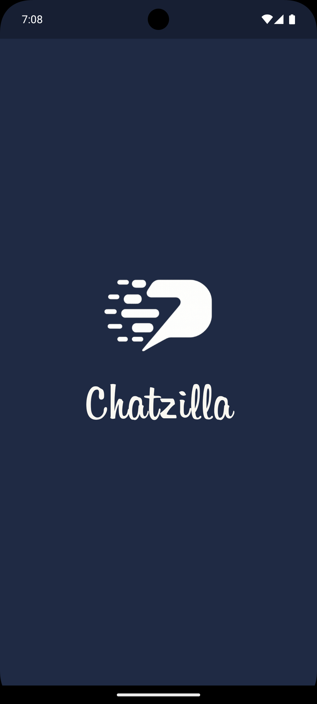 |  | 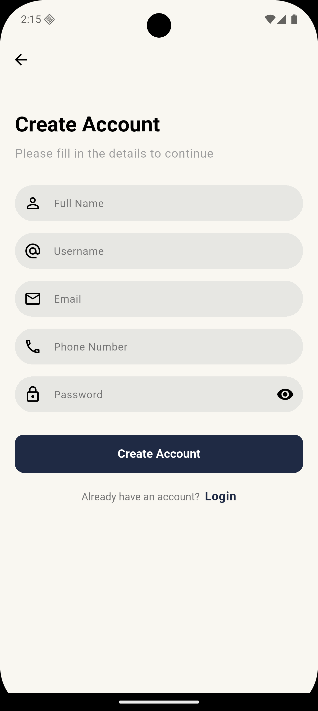 |

### Main Application Flow
| Chat Home | Contacts | Individual Chat |
|-----------|----------|-----------------|
| 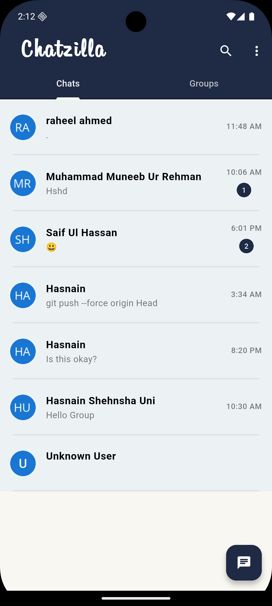 | 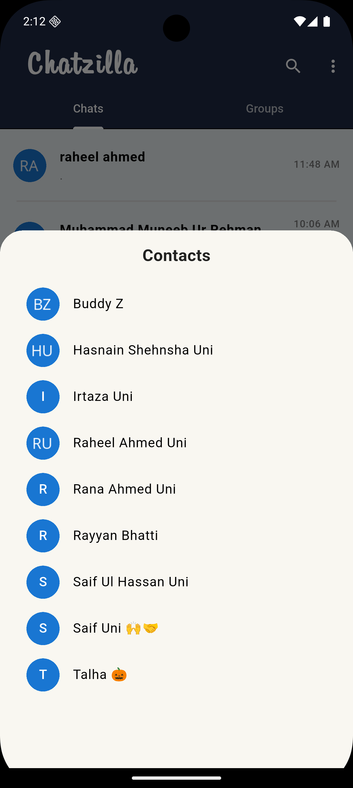 | 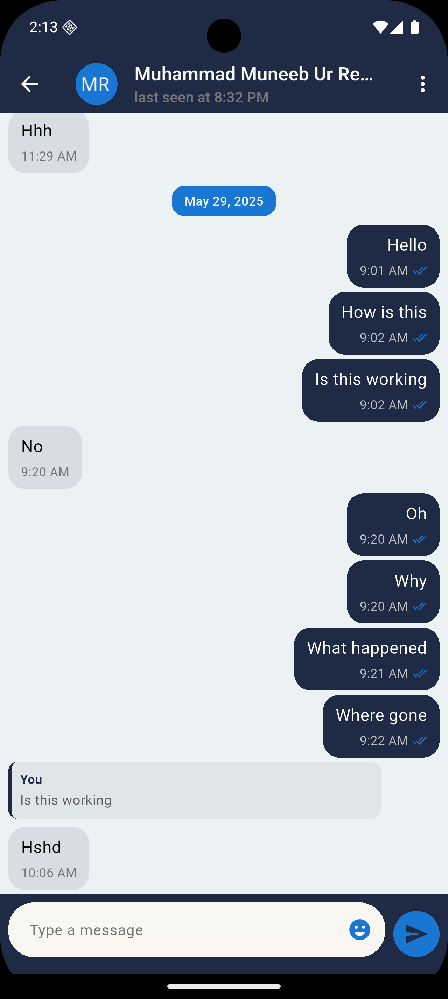 |

### Group Messaging
| Group Home | Create Group | Group Chat |
|------------|--------------|------------|
| 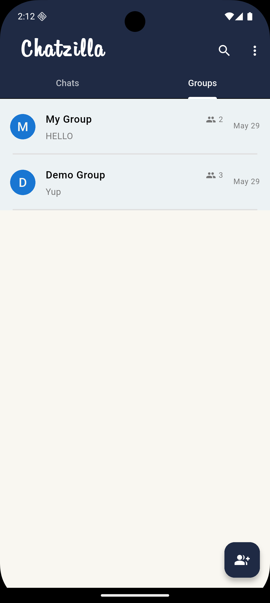 | 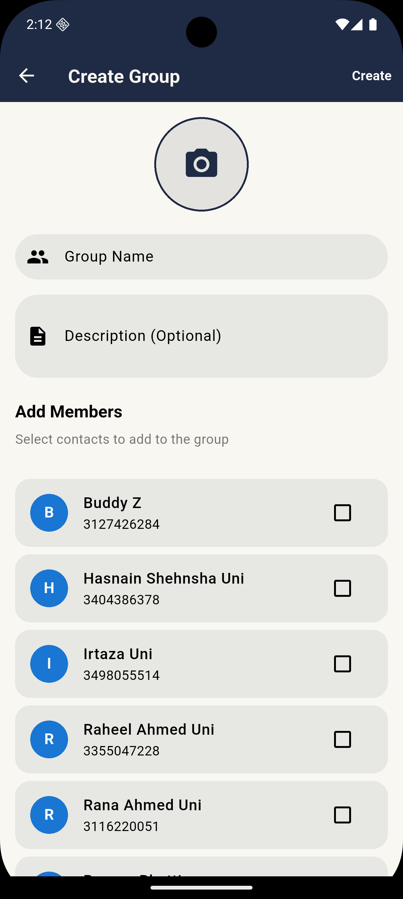 | 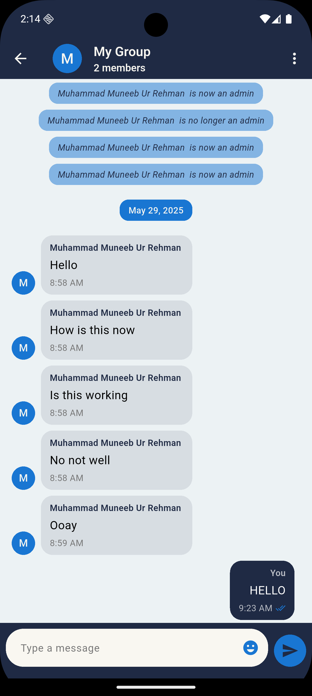 |

### User Management
| Group Info | Block User | Logout |
|------------|------------|---------|
| 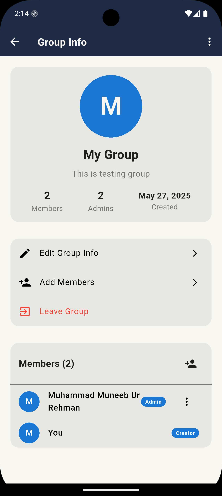 | 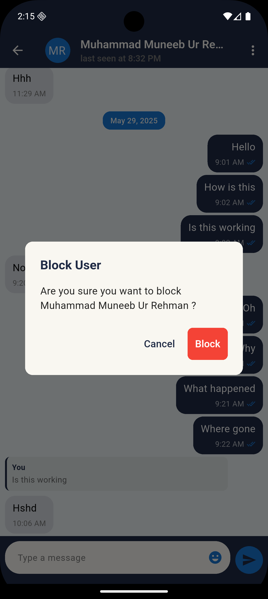 | 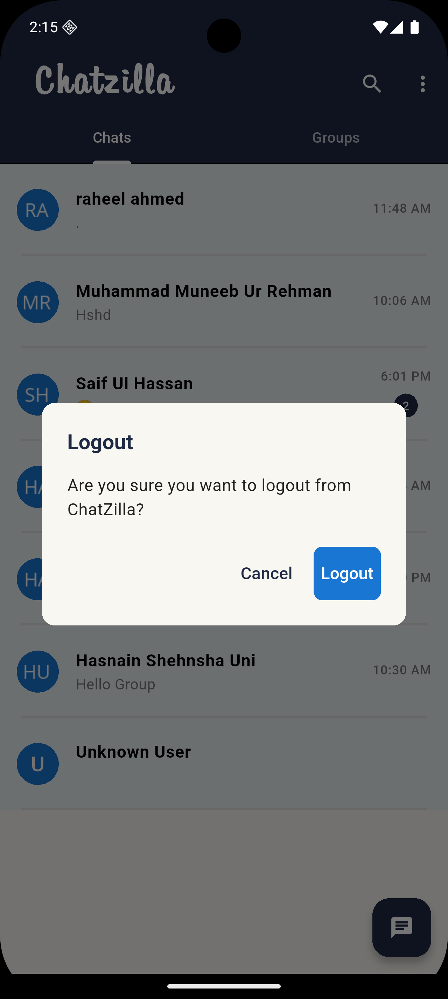 |

---

## 🛠️ Technologies Used

### Frontend
- **Flutter SDK** - Cross-platform mobile development framework
- **Dart** - Programming language for Flutter

### Backend & Services
- **Firebase Authentication** - User authentication and management
- **Cloud Firestore** - Real-time NoSQL database
- **Firebase Cloud Messaging (FCM)** - Push notifications
- **Firebase Storage** - File and media storage

### State Management
- **Bloc / GetIt** - State management solution and clean architecture

---


## 📁 Project Structure

```
lib/
├── core/              # Constants, themes, utilities
│   ├── constants/     # App constants
│   ├── themes/        # App themes
│   └── utils/         # Utility functions
├── models/            # Data models
├── services/          # Firebase integration
├── screens/           # App screens (Login, Chat, etc.)
├── widgets/           # Reusable UI components
├── controllers/       # Business logic
└── routes/            # Navigation routes
```

> For detailed folder mapping, see [Chatzilla_Repo_Map.md](./Chatzilla_Repo_Map.md)

---

## 🔧 Getting Started

### Prerequisites
- Flutter SDK (3.7.2 or higher)
- Firebase project setup
- Android Studio / VS Code
- Git

### Installation

1. **Clone the repository**
   ```bash
   git clone https://github.com/mun33b-exe/chatzilla.git
   cd chatzilla
   ```

2. **Install dependencies**
   ```bash
   flutter pub get
   ```

3. **Firebase Setup**
   - Create a Firebase project
   - Add your `google-services.json` (Android) and `GoogleService-Info.plist` (iOS)
   - Configure Firebase services (Auth, Firestore, FCM)
   - See [NOTIFICATION_SETUP.md](NOTIFICATION_SETUP.md) for detailed setup

4. **Run the application**
   ```bash
   flutter run
   ```

### Configuration
Make sure to configure your Firebase project with:
- Authentication providers (Email/Password)
- Firestore database rules
- FCM for push notifications

---

## ✅ Use Cases

| Feature | Implementation |
|---------|----------------|
| **User Registration/Login** | Firebase Authentication with email/password |
| **Send/Receive Messages** | Real-time updates via Cloud Firestore |
| **View Chat History** | Firestore queries with pagination |
| **Push Notifications** | Firebase Cloud Messaging integration |
| **Group Management** | Create, edit, and manage group chats |
| **User Blocking** | Privacy controls for user interactions |
| **Profile Management** | User data management and updates |
| **Secure Logout** | Proper session handling and cleanup |

---

## 🔮 Future Enhancements

### Planned Features
- 📸 **Media Messaging** - Image, video, and file sharing
- 📞 **Voice/Video Calling** - WebRTC integration
- 🌍 **Multi-language Support** - Internationalization
- 🌙 **Dark Mode** - Theme customization
- 📱 **Desktop Support** - Cross-platform expansion

### Advanced Features
- 🧾 **Admin Dashboard** - Web-based management panel
- 🔍 **Message Search** - Full-text search capabilities
- 📊 **Analytics** - Usage statistics and insights
- 🔒 **End-to-End Encryption** - Enhanced security
- 🤖 **AI Integration** - Smart features and chatbots

---

## 🤝 Contributing

Contributions are welcome! Please feel free to submit issues, feature requests, or pull requests.

### Steps to Contribute
1. Fork the repository
2. Create a feature branch (`git checkout -b feature/AmazingFeature`)
3. Commit your changes (`git commit -m 'Add some AmazingFeature'`)
4. Push to the branch (`git push origin feature/AmazingFeature`)
5. Open a Pull Request

---

## 📄 License

This project is open-source and available under the [MIT License](LICENSE).

---

## 🙋 Author

**Muhammad Muneeb Ur Rehman**  
Mobile App Developer | Flutter Enthusiast

[](https://www.linkedin.com/in/muneeb-ur-rehman)
[](https://github.com/mun33b-exe)

---

⭐ **Star this repository if you found it helpful!**

